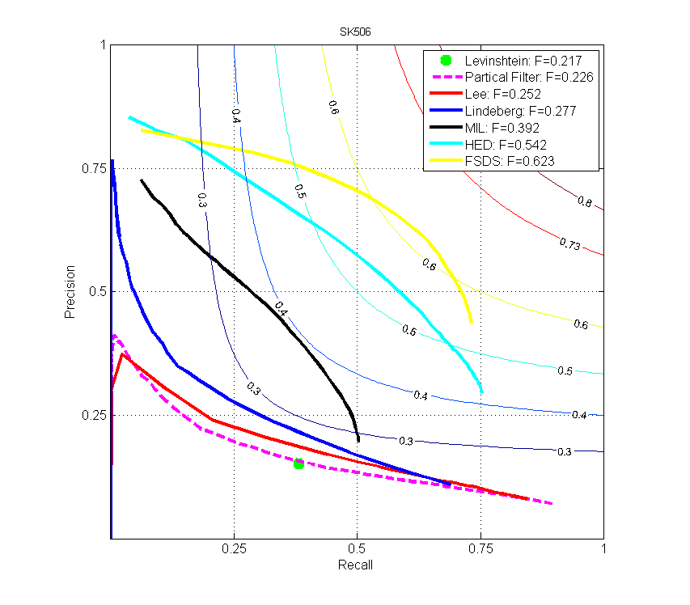
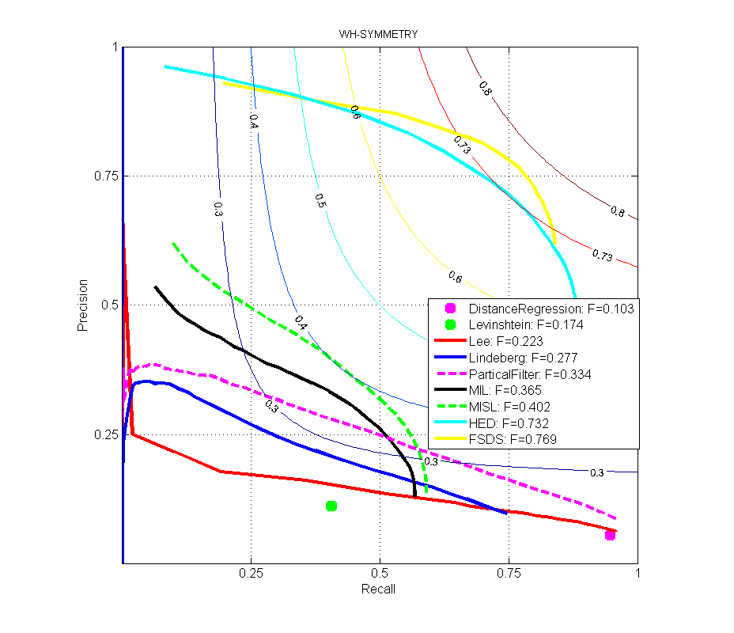

## Skeleton Evaluation

Evaluate Skeleton Detection Results.

* Run `skeval_demo.m` to perform evaluation.

* Run `pr_curve_demo.m` to plot full PR-curve.

### Example PR-curves

[Zhao Kai](http://zhaok.xyz)